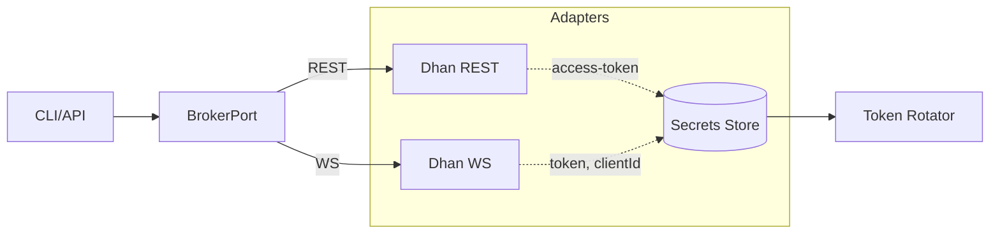

# Authentication

- Approach: Broker adapter implements token-based auth for REST; WS query params include `token`, `clientId`.
- Modes: Individual (access token or API key/secret + OAuth consent), Partner (partner_id/secret + consent). Static IP management for order placement.
- DhanHQ reference: `auth.dhan.co` consent flows; `api.dhan.co/v2/profile`; `v2/ip/*`.

## Architecture (Ports/Adapters)

## API Contracts
- User profile: `GET /v2/profile` header `access-token` → `{dhanClientId, tokenValidity, ...}`.
- Static IP: `POST /v2/ip/setIP`, `PUT /v2/ip/modifyIP`, `GET /v2/ip/getIP`.
- Consent: `POST /app/generate-consent`, browser login, `POST /app/consumeApp-consent` → `{accessToken, expiryTime}`.

## PHP Components
- HTTP: `symfony/http-client` or `guzzlehttp/guzzle` (prefer `symfony/http-client`).
- Secrets: environment `.env` + `symfony/dotenv`.
- Validation: `symfony/validator` for inputs.

## Extensions
- `ext-json`, `ext-curl`, `ext-mbstring`, `ext-openssl`, `ext-sodium`, `ext-pdo_mysql`.

## Error Handling
- Map upstream errors to internal `BROKER_ERROR`; retry only idempotent reads.

