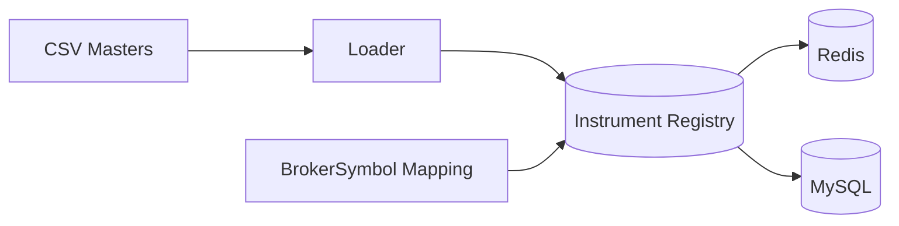

# Instrument Management

- Canonical symbol format: `{EXCHANGE}:{SYMBOL}:{TYPE}:{EXPIRY}:{STRIKE}:{OPT}`.
- Sources: Dhan CSV masters; segment-wise list `GET /v2/instrument/{exchangeSegment}`.
- Cache TTLs: instruments 24h; stale-while-revalidate; negative cache for missing security IDs.

## Architecture

## PHP Libraries
- Parsing: `league/csv` for streaming CSV parsing.
- Cache: `predis/predis`.
- DB: `illuminate/database`.

## Database
- `instruments` (primary): `id PK`, `exchange`, `symbol`, `instrument_type`, `series`, `lot_size`, `expiry_date`, `strike_price DECIMAL(10,2)`, `option_type ENUM('CE','PE','')`, `tick_size DECIMAL(10,2)`, `bracket_flag TINYINT(1)`, `cover_flag TINYINT(1)`, `asm_gsm_flag ENUM('N','R','Y')`, `buy_sell_indicator CHAR(1)`, `updated_at DATETIME`.
- Indexes: `exchange+symbol unique`, `instrument_type+expiry_date`, `strike_price`, `option_type`.

