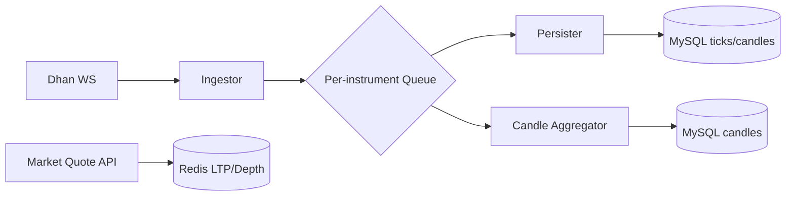

# Market Data

- WS feed: `wss://api-feed.dhan.co?version=2&token=...&clientId=...&authType=2`.
- Modes: Ticker, Quote, Full; Binary little-endian payloads.
- Snapshots: `POST /v2/marketfeed/ltp`, `ohlc`, `quote` (≤1000 instruments, 1 rps).
- Full Depth: `wss://depth-api-feed.dhan.co/twentydepth` and `wss://full-depth-api.dhan.co/twohundreddepth`.

## Processing Strategy
- Two WS workers active-active; per-instrument queue; micro-batching 10–50ms; sequence tracking; gap-fill via historical worker.
- Tick rounding: round to nearest 0.05 increment, two decimals.

## Architecture Diagram

## API Contracts (Parsing)
- Header: `feedResponseCode, msgLength, exchangeSegment, securityId`.
- Ticker: `ltp float32, ltt int32`.
- Quote: `ltp, ltq, atp, volume, totals, OHLC`.
- Full: Quote + OI + 5-level depth structure.

## PHP Components
- WS: `textalk/websocket` or `ratchet/pawl`; binary parsing with `php-binary-reader`.
- Cache: `predis/predis`.
- Logging: `monolog/monolog`.

