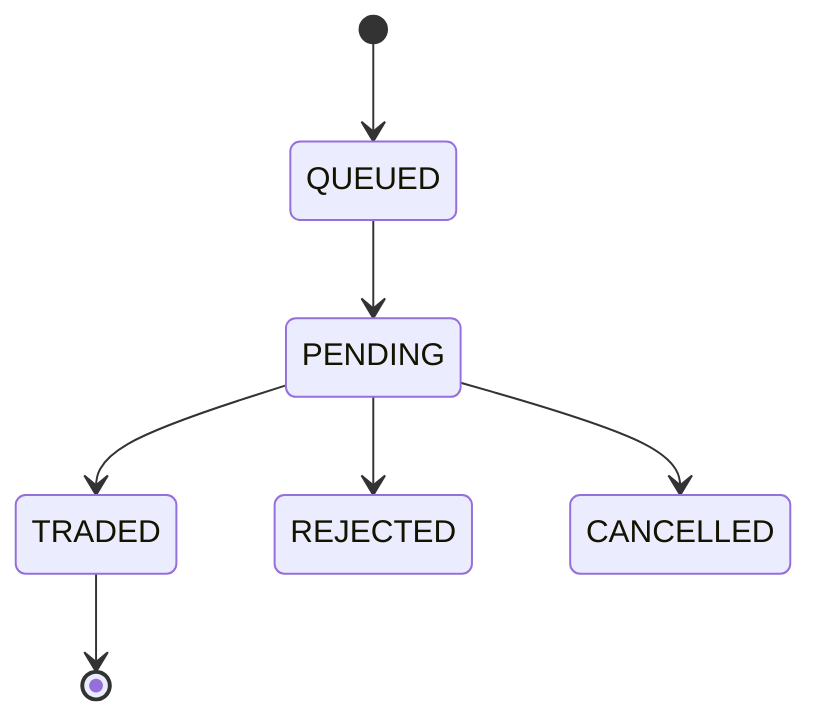

# Order Management

- Endpoints: `POST /v2/orders`, `PUT /v2/orders/{id}`, `DELETE /v2/orders/{id}`, slicing, book, trades.
- Requirements: idempotency keys; pre-trade risk/margin checks; static IP whitelisting.
- Live updates via WebSocket; Postbacks to webhook.

## State Machine

## API Contracts (Internal)
- Request envelope: `{ instrument, qty, price, clientOrderId?, idempotencyKey }`.
- Response: `{ status: 'ok|error', data: { orderId, status }, error? }`.
- Map to Dhan: pass `dhanClientId`, `exchangeSegment`, `productType`, `orderType`, `validity`, `securityId`.

## PHP Components
- HTTP: `symfony/http-client`.
- Queue: `illuminate/queue` with Redis driver.

