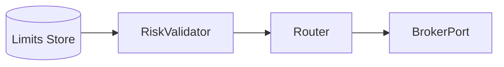

# Risk & Trader Controls

- Kill Switch: `POST /v2/killswitch?killSwitchStatus=ACTIVATE|DEACTIVATE`.
- Pre-trade checks: position limits, notional limits, max concurrent trades.
- Stop/Take Profit framework; bracket orders via Dhan products.

## Architecture

