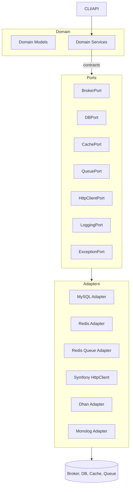

# Architecture (Hexagonal)

## Diagram

## Namespaces
- `App\Domain`: models, value objects, services.
- `App\Infrastructure`: adapters and ports.
- `App\Shared`: utilities (DateTime, String, Array, JSON, Enum, Validation, Currency, Number).
- `App\Tests`: test utilities.

## DI
- Constructor injection; factories for adapters; config via env.

